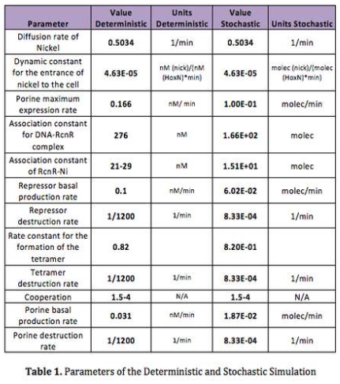

# Judging Basics

To get a gold medal, an iGEM team must satisfy all bronze and silver requirements in addition to two gold requirements. Modeling is a Gold criteria for iGEM projects. Therefore, a strong modeling team can make a project much more competitive. However, not every modeling project will be enough to fulfill the requirement or impress the judges. 

## Judging Criteria

### Criteria requirements
From the iGEM 2018 website: 

>Convince the judges that your project's design and/or implementation is based on insight you have gained from modeling. This could be either a new model you develop or the implementation of a model from a previous team. You must **thoroughly document your model's contribution** to your project on your team's wiki, **including assumptions, relevant data, model results, and a clear explanation of your model that anyone can understand.**

>The model should impact your project design in a meaningful way. Modeling may include, but is not limited to, deterministic, exploratory, molecular dynamic, and stochastic models. Teams may also explore the physical modeling of a single component within a system or utilize mathematical modeling for predicting function of a more complex device.

As you can see, the website emphasizes that our project will be judged based on its documentation. With so many amazing projects and so little time, the judges will look more favorably on projects that are easy to understand. If we have the time and resources, making a video guide to our results would be an especially powerful way to convey this to the judges, especially if we do a COMSOL model.

### Judging guide

The judge handbook has additional information about the modelling criteria. It states that our model will be judged on four aspects:

1. How impressive is the mathematical modeling?
2. Did the model help the team understand their part or device?
3. Did the team use measurements of the device to develop the model?
4. Does the modeling approach provide a good example for others?

The third aspect is very important. We should be cognizant about how we're going to collect the data from wetlab.

## Winning Model Examples

### [Colombia Uniandes 2013: Detailed, well-researched stochastic model](http://2013.igem.org/Team:Colombia_Uniandes)
The model that Colombia Uniandes created is nothing new. It is a fairly standard stochastic model. However, the judges selected it in particular because of the impressive attention to detail on their model. See the table below:

Every one of their examples is backed up by a cited paper and a blurb explaining why that paper is relevant to their value. 

Also, note what the judging handbook has to say about this example:
> In iGEM, as in life, one encounters many models composed entirely of educated guesses masquerading as parameters.
That should send a chill down your spine. It is clear that the judges will pay attention to where your parameters come from. If and when we make a tellurium model of our project we should have papers to back up every parameter that we've used. 
Other things to note are that tables are a great way to organize our information about our model.

### [OUC-China 2013: Novel magnetic analysis model](http://2013.igem.org/Team:OUC-China/Magnetic_Analysis)
OUC-China developed a novel system to quantatively analyze the magnetic detection ability of the sample bacteria. They designed a new mathematical model, crafted a custom device to measure magnetic fields, and used data from the measurements to revise their model. 

OUC-China shows us that judges highly value novel approaches to designs. They also demonstrate that using real-world measurements to . 

### [Evry 2012: Integrated multiscale model]()
Evry 2012 went above and beyond the call of duty. They modeled their tadpole at the cellular level, the multicell level, the organ level, and finally the organism level. Though the math that they used isn't special, the obvious work they put into building a comprehensive, interconnected model was highly appreciated by the judges. 

The graphical explanation for their model is simply stunning. 
