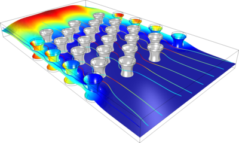

# What can simulations do for you?
Simulations works hand-in-hand with project development to understand different avenues of our project. Simulations should be used to ask questions that would be expensive and time-consuming to answer if done in the wet lab. 

Apart from that, simulations is also one of the gold medal criteria. To get a gold medal, we need all bronze and silver criteria in addition to at least two gold medal criteria. There is also a best model award that we will be competing for. Personally, I think we have a good shot at the best model award, as we have a large and well-led simulations team.

## What tools do the simulations team have experience in?

### Tellurium
[Tellurium](https://tellurium.readthedocs.io/en/latest/index.html) is a python environment developed for dynamically modeling biological networks. 
 
Tellurium is open source and developed by Dr. Sauro, so we have plenty of resources to learn how to effectively use it. Tellurium is coded in C++ in the backend, so it's fast enough to be used for complex systems. It can model ODEs, PDEs, and stochastic differential equations. ODEs and PDEs are standard ways of modeling , and have a long history in iGEM competitions. In many ways, Tellurium is our substitute for an expensive multi-paradigm numerical computing system such MATLAB.

Tellurium is most useful for understanding the kinetics of a system. Kinetics give us insight into how fast a reaction proceeds. When applied to a gene network, we gain insight into , how often a gene is transcribed, whether or not a system comes to a steady state, and how the system acts if it is perturbed. 

The classic understanding of the kinetics of a system is that the rate-limiting step controls the rate at which the overall reaction proceeds. If you increase the rate of the rate-limiting step, then you increase the rate of the overall reaction. The rate limiting step has complete "control" over the overall reaction rate. However, real systems are rarely this simple, especially when a biological network has feedback loops. Control is typically shared unequally between multiple steps, and it is rarely easy to identify which steps have greater control than others. Tellurium gives us an option for computing , which can give us insights for how to efficiently manufacture a molecule of interest or how we can modify the gene network to make a cell produce more or less of a compound. 

### Rosetta
[Rosetta](https://www.rosettacommons.org/software) is a powerful command-line program for modeling protein folding developed at the UW's Baker lab.

Proteins naturally fold into the lowest energy conformation. However, modeling this process on an atom-by-atom basis is NP-hard, and cannot be easily done without a supercomputer.

Rosetta reduces the computational complexity by dividing the sequence into fragments and substituting known folding patterns of the fragments into the protein. Then, it tries random conformations in space and does a monte carlo simulation to find the lowest energy conformation. Essentially, it tries a random conformation and then makes a random change to it. If the change reduced the free energy, the simulation continues from the new conformation. If the change increased the free energy, the simulation reverts to the old conformation.

Rosetta does not seem as directly relevant as Tellurium to project development. However, it may be useful in other ways. Given a sequence for a nanobody, we could model it in Rosetta and use that to make pictures for the wiki. We could also use it for outreach. Currently, there is major interest in *de novo* protein design, and with Rosetta we can model proteins on a laptop. During an outreach event, we could show middle or high schoolers how to model proteins in Rosetta and then compare them to the real proteins.

Rosetta may also have relevance as a side project for the team. We are trying to plan meetings with Dr. Gu and Dr. Frank Dimaio to discuss this further.

### COMSOL
[COMSOL Multiphysics](https://en.wikipedia.org/wiki/COMSOL_Multiphysics) is an industry-standard program for simulating electrical, chemical, acoustic, and fluid physics. COMSOL can be used for an expansive number of applications.  

COMSOL is best used for modelling *in vitro* systems, as it doesn't have very good support for biological systems. If we were making an in vitro biosensor or a measurement device, however, COMSOL is very appropriate.

# What can you do for simulations?
The first way that you can help is by asking questions that can be answered by simulations. /. Simulations and project development should go hand in hand. 

A second way you can help is by giving us data to refine our models. A huge part of simulations is **validation.** If a model is valid, that means that it accurately captures the real system. Validation can only be done with real data. It is also one of the criteria by which judges will judge our project for best model.